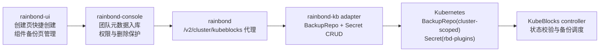

# KubeBlocks BackupRepo 团队级管理设计文档

## 一、项目背景
### 1.1 项目架构
Rainbond 当前通过 `rainbond-ui -> rainbond-console -> rainbond -> rainbond-plugins/rainbond-kb adapter -> Kubernetes` 管理 KubeBlocks 数据库。数据库创建和组件备份设置里的 BackupRepo 目前只从 adapter 查询已有集群级 `BackupRepo`，并把仓库名透传给 KubeBlocks Cluster 备份配置。

### 1.2 现有基础
- `rainbond-ui` 已有数据库创建页、组件视图备份 Tab、`kubeblocks` DVA model 和 service。
- `rainbond-console` 已有 `KubeBlocksBackupReposView` 和 `kubeblocks_service.get_backup_repos`，但不做团队级入库。
- `rainbond` 的 `KubeBlocksController` 负责把 `/v2/cluster/kubeblocks/*` 请求代理到 `kb-adapter-rbdplugin`。
- `rainbond-plugins/rainbond-kb` 已支持 `GET /v1/backuprepos`，但只返回 Ready 的 BackupRepo；RBAC 也只有 `backuprepos list/watch`。

### 1.3 核心需求
将 KubeBlocks `BackupRepo` 管理集成到 Rainbond 平台：
- 数据库创建页的备份设置支持快捷创建 S3 BackupRepo。
- 组件视图的备份 Tab 支持管理团队下的 S3 BackupRepo，包括创建、编辑、删除。
- `BackupRepo` 是集群级资源，但在 Rainbond 中按团队归属管理，console 需要入库存储团队与仓库关系。
- 为避免集群级重名，真实 `BackupRepo` 名称和凭据 Secret 名称必须加团队 namespace 前缀。
- S3 凭据 Secret 固定创建在 `rbd-plugins` namespace，不在 UI/API 响应中回显密钥。

## 二、用户旅程（MUST — 禁止跳过）
### 2.1 用户操作流程
- 用户如何配置/触发该功能？
  - 在数据库创建页的“备份设置”中，用户可以选择已有团队 S3 仓库，也可以点击“新建 S3”快速填写显示名、Bucket、Endpoint、Region、AccessKey、SecretKey、容量等字段。创建成功后自动选中新仓库。
  - 在组件视图的“备份” Tab 中，用户可以点击“管理 S3 仓库”打开管理抽屉或区域，查看团队下所有 S3 仓库，并执行新增、编辑、删除。
- 用户如何查看状态/结果？
  - 创建页只展示仓库可选项和基本可用状态。
  - 组件备份页展示仓库表格：显示名、真实 BackupRepo 名称、Bucket、Endpoint、Region、状态、当前是否被使用、操作。
  - 备份策略保存后继续展示当前仓库、周期、保留期和备份列表。
- 管理员/审批人如何操作？
  - 沿用团队权限体系。能进入数据库组件备份设置并具备相关管理权限的用户可以管理该团队仓库。
  - 平台管理员不新增单独入口；该功能先落在团队组件视图内，避免平台级资源误操作。

### 2.2 页面原型
- 数据库创建页：在现有 `DatabaseBackupConfig` 的 BackupRepo 选择框右侧增加“新建 S3”按钮。弹窗为轻量创建表单，成功后刷新仓库列表并选中。
- 组件视图备份 Tab：在现有“备份设置”卡片右上角增加“管理 S3 仓库”。管理区域使用表格 + 创建/编辑弹窗：
  - 创建：填写完整 S3 信息和密钥。
  - 编辑：允许修改显示名、Bucket、Endpoint、Region、容量、凭据；密钥字段留空表示不变。
  - 删除：二次确认；若仓库仍被任意 KubeBlocks Cluster 引用，后端拒绝删除。

### 2.3 外部系统交互
- Kubernetes：adapter 创建/更新/删除 `dataprotection.kubeblocks.io/v1alpha1 BackupRepo` 和 `v1 Secret`。
- KubeBlocks：BackupRepo controller 根据资源状态更新 `status.phase`。
- S3/兼容 S3 服务：Rainbond 只保存连接配置和创建 Kubernetes 资源，不直接校验或访问对象存储；连通性由 KubeBlocks controller 体现为状态。

## 三、整体架构设计
### 3.1 系统架构图


### 3.2 核心流程
1. 创建 S3 仓库：
   - UI 提交 S3 表单到 console。
   - console 生成真实名称：`{tenant.namespace}-{user_input_name}`，并保存团队元数据。
   - console 调 rainbond region API。
   - rainbond 代理到 adapter。
   - adapter 创建或更新 `rbd-plugins/{repo_name}-secret`，再创建集群级 `BackupRepo/{repo_name}`。
2. 选择仓库创建数据库：
   - 创建页拿到团队仓库列表。
   - 用户选择某仓库，console 创建 KubeBlocks Component 时继续把 `backup_repo` 透传到 adapter 创建 Cluster。
3. 更新组件备份设置：
   - 组件备份 Tab 选择团队仓库并保存。
   - console 校验仓库属于当前团队，再调用现有 backup config 更新链路。
4. 删除仓库：
   - console 校验仓库属于当前团队。
   - adapter 检查所有 KubeBlocks Cluster 是否引用该 repo；若引用则返回冲突。
   - 未引用时删除 BackupRepo，再删除 `rbd-plugins` 中对应 Secret。
   - console 标记元数据删除或删除记录。

## 四、数据模型设计
### 4.1 新增数据库表
新增 console 表 `kubeblocks_backup_repo`：

| 字段 | 类型 | 说明 |
|------|------|------|
| `ID` | int | 主键 |
| `tenant_id` | varchar(32) | 团队 ID |
| `team_name` | varchar(64) | 团队名称冗余，便于排查 |
| `region_name` | varchar(64) | 数据中心名称 |
| `namespace` | varchar(64) | 团队 namespace |
| `display_name` | varchar(64) | UI 显示名 |
| `repo_name` | varchar(128) | 集群级 BackupRepo 名称，格式 `{namespace}-{name}` |
| `secret_name` | varchar(128) | `rbd-plugins` 中的 Secret 名称 |
| `secret_namespace` | varchar(64) | 固定为 `rbd-plugins` |
| `storage_provider` | varchar(32) | 首期固定 `s3`，兼容 `minio` |
| `access_method` | varchar(16) | 固定默认 `Tool` |
| `bucket` | varchar(255) | S3 Bucket |
| `endpoint` | varchar(255) | S3 endpoint |
| `region` | varchar(64) | S3 region |
| `volume_capacity` | varchar(32) | BackupRepo PVC 容量，默认 `100Gi` |
| `pv_reclaim_policy` | varchar(16) | 默认 `Retain` |
| `path_prefix` | varchar(255) | 可选路径前缀 |
| `status` | varchar(32) | console 侧记录状态 |
| `is_deleted` | bool | 软删除标记 |
| `creator` | varchar(64) | 创建人 |
| `create_time` / `update_time` | datetime | 时间 |

唯一约束：
- `(region_name, repo_name)` 全局唯一，匹配集群级 BackupRepo。
- `(tenant_id, region_name, display_name, is_deleted)` 避免团队内显示名重复。

### 4.2 数据关系
- `kubeblocks_backup_repo.tenant_id` 关联 `tenant_info.tenant_id`。
- 真实 K8s `BackupRepo.metadata.name` 对应 `repo_name`。
- 真实 K8s `BackupRepo.spec.credential.name` 对应 `secret_name`，`namespace` 固定 `rbd-plugins`。
- 不在 console 数据库保存 `accessKeyId` / `secretAccessKey` 明文。

## 五、API设计
### 5.1 接口列表
adapter (`rainbond-plugins/rainbond-kb`)：
- `GET /v1/backuprepos`：保留现有列表，扩展返回 config/status。
- `POST /v1/backuprepos`：创建 S3 BackupRepo 和 Secret。
- `PUT /v1/backuprepos/:name`：更新 BackupRepo 可变配置和可选 Secret。
- `DELETE /v1/backuprepos/:name`：删除 BackupRepo 和 Secret；被 Cluster 引用时返回冲突。

rainbond：
- `GET /v2/cluster/kubeblocks/backup-repos`
- `POST /v2/cluster/kubeblocks/backup-repos`
- `PUT /v2/cluster/kubeblocks/backup-repos/{name}`
- `DELETE /v2/cluster/kubeblocks/backup-repos/{name}`

console：
- `GET /console/teams/{team_name}/regions/{region_name}/kubeblocks/backup_repos`
- `POST /console/teams/{team_name}/regions/{region_name}/kubeblocks/backup_repos`
- `PUT /console/teams/{team_name}/regions/{region_name}/kubeblocks/backup_repos/{repo_name}`
- `DELETE /console/teams/{team_name}/regions/{region_name}/kubeblocks/backup_repos/{repo_name}`

### 5.2 请求/响应结构
创建请求：
```json
{
  "display_name": "生产备份仓库",
  "name": "prod-s3",
  "bucket": "rainbond-backup",
  "endpoint": "https://s3.example.com",
  "region": "cn-hangzhou",
  "access_key_id": "$S3_ACCESS_KEY_ID",
  "secret_access_key": "$S3_SECRET_ACCESS_KEY",
  "volume_capacity": "100Gi",
  "path_prefix": ""
}
```

console 转换后的 adapter 请求：
```json
{
  "name": "team-ns-prod-s3",
  "displayName": "生产备份仓库",
  "storageProviderRef": "s3",
  "accessMethod": "Tool",
  "pvReclaimPolicy": "Retain",
  "volumeCapacity": "100Gi",
  "config": {
    "bucket": "rainbond-backup",
    "endpoint": "https://s3.example.com",
    "region": "cn-hangzhou"
  },
  "credential": {
    "name": "team-ns-prod-s3-secret",
    "namespace": "rbd-plugins"
  },
  "secrets": {
    "accessKeyId": "$S3_ACCESS_KEY_ID",
    "secretAccessKey": "$S3_SECRET_ACCESS_KEY"
  }
}
```

列表响应：
```json
{
  "list": [
    {
      "displayName": "生产备份仓库",
      "name": "team-ns-prod-s3",
      "bucket": "rainbond-backup",
      "endpoint": "https://s3.example.com",
      "region": "cn-hangzhou",
      "phase": "Ready",
      "accessMethod": "Tool",
      "storageProviderRef": "s3",
      "used": true
    }
  ]
}
```

## 六、核心实现设计
### 6.1 关键逻辑
- 名称规范：
  - 用户输入 `name` 只允许小写字母、数字、`-`。
  - console 统一生成 `repo_name = "{tenant.namespace}-{name}"`。
  - Secret 名称为 `"{repo_name}-secret"`，namespace 固定 `rbd-plugins`。
- 权限与归属：
  - console 所有管理接口必须通过 `RegionTenantHeaderView` 获取当前团队。
  - 更新/删除只能操作本团队 DB 记录。
  - 组件备份策略更新时，如果 `backupRepo` 非空，必须校验该 repo 属于当前团队。
- 密钥安全：
  - UI 创建/编辑提交密钥，后端只写入 Kubernetes Secret，不入库、不回显。
  - 编辑时密钥留空表示保持现有 Secret 不变。
- 更新限制：
  - `BackupRepo.spec.storageProviderRef` 是 immutable，首期不允许改 provider。
  - 编辑只覆盖 `config`、`credential`、`volumeCapacity`、`pathPrefix`、Secret 数据等可变项。
- 删除保护：
  - adapter 删除前遍历 KubeBlocks Cluster，若任意 `spec.backup.repoName == repo_name` 则返回冲突。
  - console 收到冲突后保留 DB 记录并提示先解绑备份策略。
- 状态同步：
  - console 列表以 DB 记录为主，调用 adapter 列表补齐 `phase`、`conditions`、`generatedStorageClassName` 等 live 状态。
  - 若 K8s 资源不存在，显示 `Missing`，允许用户重新创建或删除 DB 记录。

### 6.2 复用现有代码
- `rainbond-ui/src/services/kubeblocks.js` 和 `src/models/kubeblocks.js` 扩展仓库 CRUD effect。
- 创建页复用 `DatabaseBackupConfig`，增加 `onCreateRepo` 回调。
- 组件备份页复用现有 `databaseBackup.js` 的备份策略保存和列表刷新逻辑，新增仓库管理弹窗。
- `rainbond-console/console/views/kubeblocks.py` 扩展 `KubeBlocksBackupReposView` 的 POST/PUT/DELETE。
- `rainbond-console/console/services/kubeblocks_service.py` 复用 region API 调用模式，并增加团队 repo 校验。
- `rainbond/api/controller/kubeblocks.go` 继续使用 `forwardRequest`。
- `rainbond-plugins/rainbond-kb/service/backup` 复用 controller-runtime client 和现有 BackupRepo model。

## 七、实施计划
### 跨层覆盖检查（MUST）
- [x] Go (rainbond): 需要 — 扩展 BackupRepo CRUD 代理路由和 controller 方法。
- [x] Python (console): 需要 — 新增团队 BackupRepo 模型、迁移、repository、service、view、RegionInvokeApi 调用。
- [x] React (rainbond-ui): 需要 — 创建页快捷创建 S3；组件备份 Tab 仓库管理；i18n。
- [ ] Plugin frontend (enterprise-base): 不涉及 — 功能在宿主 rainbond-ui 内实现。
- [x] Plugin backend / adapter (rainbond-plugins/rainbond-kb): 需要 — 创建/更新/删除 K8s Secret 与 BackupRepo，扩展 RBAC 与测试。

### Sprint 1: adapter 真实资源能力
#### Task 1.1: 请求模型与 API 路由
- 仓库：rainbond-plugins/rainbond-kb
- 文件：`api/req/req.go`, `api/router.go`, `api/handler/handler.go`
- 实现内容：新增 BackupRepo create/update/delete request，注册 POST/PUT/DELETE 路由。
- 验收标准：handler 单测覆盖请求绑定和 service 调用。

#### Task 1.2: BackupRepo/Secret CRUD
- 仓库：rainbond-plugins/rainbond-kb
- 文件：`internal/model/backup.go`, `service/service.go`, `service/backup/backup.go`
- 实现内容：创建/更新 Secret 和 BackupRepo；删除前检查 Cluster 引用；列表返回更多配置字段。
- 验收标准：Go 单测覆盖创建、更新密钥留空、删除冲突、正常删除。

#### Task 1.3: RBAC
- 仓库：rainbond-plugins/rainbond-kb
- 文件：`deploy/k8s/deploy.yaml`
- 实现内容：`backuprepos` 增加 get/create/update/patch/delete；`secrets` 增加 get/create/update/patch/delete。
- 验收标准：`go test ./...` 通过。

### Sprint 2: rainbond 代理层
#### Task 2.1: 代理路由
- 仓库：rainbond
- 文件：`api/controller/kubeblocks.go`, `api/api_routers/version2/v2Routers.go`, `api/api/api_interface.go`
- 实现内容：新增 BackupRepo POST/PUT/DELETE 代理。
- 验收标准：现有 kubeblocks controller 测试扩展覆盖目标 URL、method。

### Sprint 3: console 团队级管理
#### Task 3.1: 数据模型和迁移
- 仓库：rainbond-console
- 文件：`console/models/main.py`, `console/migrations/*.py`, `sql/migrations/*.sql`
- 实现内容：新增 `KubeBlocksBackupRepo` 模型和建表迁移。
- 验收标准：模型字段、唯一约束与 SQL 一致。

#### Task 3.2: repository/service/API
- 仓库：rainbond-console
- 文件：`console/repositories/kubeblocks_backup_repo.py`, `console/services/kubeblocks_service.py`, `console/views/kubeblocks.py`, `console/urls/__init__.py`, `www/apiclient/regionapi.py`
- 实现内容：团队仓库 CRUD、名称前缀、Secret namespace 固定 `rbd-plugins`、live 状态合并、组件备份策略 repo 归属校验。
- 验收标准：pytest 覆盖创建、重复名、列表合并、删除冲突、跨团队禁止操作。

### Sprint 4: UI
#### Task 4.1: API 和 model
- 仓库：rainbond-ui
- 文件：`src/services/kubeblocks.js`, `src/models/kubeblocks.js`
- 实现内容：新增 create/update/delete BackupRepo service 和 DVA effects。
- 验收标准：路径与 console URL 对齐。

#### Task 4.2: 创建页快捷创建
- 仓库：rainbond-ui
- 文件：`src/components/DatabaseBackupConfig/index.js`, `src/pages/Create/database-config.js`
- 实现内容：选择框旁增加“新建 S3”，成功后刷新并自动选中。
- 验收标准：`yarn build` 通过；创建数据库请求仍传 `backup_repo`。

#### Task 4.3: 组件备份页仓库管理
- 仓库：rainbond-ui
- 文件：`src/pages/Component/databaseBackup.js`, locales
- 实现内容：管理 S3 仓库表格和创建/编辑/删除弹窗；密钥不回显；删除冲突提示。
- 验收标准：`yarn build` 通过；备份策略保存前能选择新建仓库。

## 八、关键参考代码
| 功能 | 文件 | 说明 |
|------|------|------|
| adapter BackupRepo 列表 | `rainbond-plugins/rainbond-kb/service/backup/backup.go` | 现有 `ListAvailableBackupRepos` 和 KubeBlocks typed client 使用方式 |
| adapter API | `rainbond-plugins/rainbond-kb/api/router.go` | 现有 `/v1/backuprepos` 路由 |
| adapter RBAC | `rainbond-plugins/rainbond-kb/deploy/k8s/deploy.yaml` | 需要补齐 BackupRepo/Secret 写权限 |
| rainbond 代理 | `rainbond/api/controller/kubeblocks.go` | 现有 `forwardRequest` |
| console KubeBlocks view | `rainbond-console/console/views/kubeblocks.py` | 现有 BackupRepo list 和备份配置更新入口 |
| console 创建 KubeBlocks 组件 | `rainbond-console/console/services/kubeblocks_service.py` | 现有 `backup_repo` 透传逻辑 |
| UI 创建页 | `rainbond-ui/src/pages/Create/database-config.js` | 现有数据库创建和 BackupRepo 格式化逻辑 |
| UI 组件备份页 | `rainbond-ui/src/pages/Component/databaseBackup.js` | 现有备份策略和备份列表管理 |
