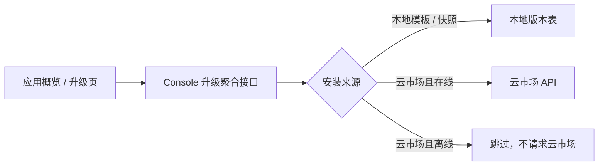

# Rainbond Console 本地快照离线升级检测设计文档

## 一、项目背景

### 1.1 项目架构

Rainbond UI 通过 Console 的应用概览和升级接口展示可升级模板。Console 在读取已安装组件的来源记录后，分别查询本地模板库或云市场，聚合应用级更新状态。

### 1.2 现有基础

- 应用概览调用 `GET /console/teams/{team}/groups/{app}/upgradable_num` 显示可更新数量。
- 应用升级页和应用版本中心的“来源升级”列表复用 `MarketAppService.get_market_apps_in_app`。
- 应用快照作为 `source=local`、`template_type=application_version` 的团队本地模板保存；安装后组件组和组件来源记录会保存模板 ID 与安装版本。
- `DISABLE_DEFAULT_APP_MARKET` 和 `DISABLE_CLOUD_MARKET` 用于阻止云市场访问。

### 1.3 核心需求

在离线模式或禁用云市场时，已由本地模板/应用快照安装的应用仍须检测并显示后续本地版本；云市场来源则必须被跳过，不能触发外部市场请求。

## 二、用户旅程

### 2.1 用户操作流程

1. 用户从团队本地模板或应用快照安装版本 `1.0.2`。
2. 模板发布者创建同一模板的版本 `1.0.3`。
3. 用户进入应用概览、应用升级页或应用版本中心的来源升级面板。
4. 平台显示 `1.0.3` 可升级，用户可进入已有的升级流程。

用户无需新增配置入口；已有的离线/云市场禁用开关继续生效，但仅约束云市场来源。

### 2.2 页面原型

- 应用概览页：已有“更新”数量；修复后本地快照升级应计入数量。
- 应用升级页：已有可升级应用模板列表；修复后应列出本地快照来源。
- 应用版本中心：已有“来源升级”抽屉；修复后应显示本地快照版本。

不新增页面、弹窗或表单。

### 2.3 外部系统交互

- 本地模板/快照：只读取 Console 数据库中的 `rainbond_center_app_version`，不访问外部系统。
- 云市场模板：离线模式下直接跳过，避免调用云市场 API。

## 三、整体架构设计

### 3.1 系统架构图

### 3.2 核心流程

1. 收集应用中每个组件组的来源和当前版本。
2. 对本地来源，始终查询本地版本记录并按语义版本比较。
3. 对云市场来源，仅在云市场可用时查询远端版本。
4. 将有更高版本的来源聚合为可升级项，供现有接口和 UI 展示。

## 四、数据模型设计

### 4.1 新增数据库表

不新增数据库表或字段。

### 4.2 数据关系

- `tenant_service_group.group_key/group_version` 保存安装模板 ID 与当前模板版本。
- `service_source.group_key/version` 记录组件的模板来源。
- `rainbond_center_app_version` 以 `app_id` 和 `version` 保存本地模板、快照及其版本。

## 五、API 设计

### 5.1 接口列表

现有接口保持不变：

- `GET /console/teams/{team}/groups/{app}/upgradable_num`
- `GET /console/teams/{team}/groups/{app}/market_apps`
- 既有应用升级相关接口

### 5.2 请求/响应结构

不变。修复后，响应中的 `can_upgrade`、`upgrade_versions` 和 `upgradable_num` 能正确包含本地快照来源。

## 六、核心实现设计

### 6.1 关键逻辑

- 删除升级聚合入口对 `is_cloud_market_disabled()` 的全局短路。
- 当来源为云市场且云市场被禁用时，跳过该来源。
- 将版本查询方法的禁用判断限定到云市场分支；本地分支继续通过 `rainbond_app_repo.get_rainbond_app_versions` 查询。
- 使用回归测试保护：离线时本地 `1.0.2 -> 1.0.3` 可升级，云市场来源被跳过，在线行为保持不变。

### 6.2 复用现有代码

- `ServiceSourceInfo.is_install_from_cloud()` 判断来源。
- `is_cloud_market_disabled()` 判断云市场可用性。
- `compare_version()` 和 `sorted_versions()` 比较并排序版本。
- `rainbond_app_repo.get_rainbond_app_versions()` 查询本地版本。

## 七、实施计划

### 跨层覆盖检查

- [ ] Go (rainbond): 不涉及 — 无 Region API、数据模型或 worker 变更。
- [x] Python (console): 需要 — 调整升级来源筛选、版本查询守卫，并补回归测试和测试清单。
- [ ] React (rainbond-ui): 不涉及 — 继续消费既有字段和接口。
- [ ] Plugin: 不涉及 — 无插件前后端变更。

### Sprint 1: 保持离线本地升级检测

#### Task 1.1: 定义离线来源筛选回归测试

- 仓库：rainbond-console
- 文件：`console/tests/market_app_service_test.py`（新增或复用同风格测试文件）、`test-manifest.json`
- 实现内容：为本地快照版本、云市场来源和在线来源建立可升级性断言。
- 验收标准：新测试在修复前失败；测试清单验证通过。

#### Task 1.2: 按来源限制离线守卫

- 仓库：rainbond-console
- 文件：`console/services/market_app_service.py:1575-1817`
- 实现内容：本地来源绕过云市场禁用短路；云市场来源仍被跳过。
- 验收标准：本地快照 `1.0.2 -> 1.0.3` 被标识为可升级，离线时不调用云市场查询。

## 八、关键参考代码

| 功能 | 文件 | 说明 |
|---|---|---|
| 概览更新数量 | `console/views/group.py` | 调用升级聚合服务生成 `upgradable_num` |
| 来源升级聚合 | `console/services/market_app_service.py` | 当前含过宽的离线短路，需修复 |
| 离线开关 | `console/utils/offline.py` | 判断云市场是否禁用 |
| 快照本地模板 | `console/services/app_version_service.py` | 快照保存为本地 `application_version` 模板 |
